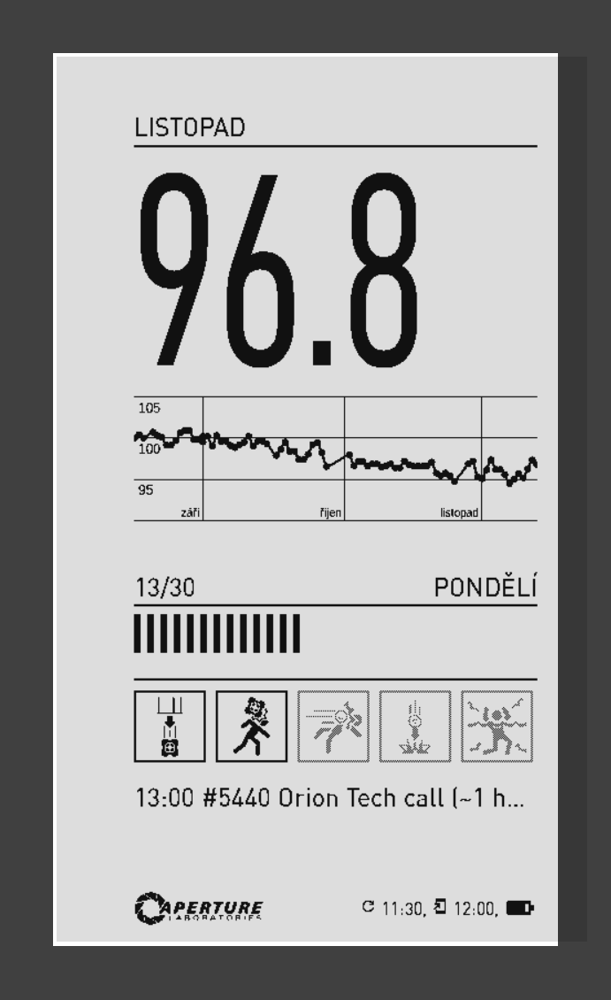
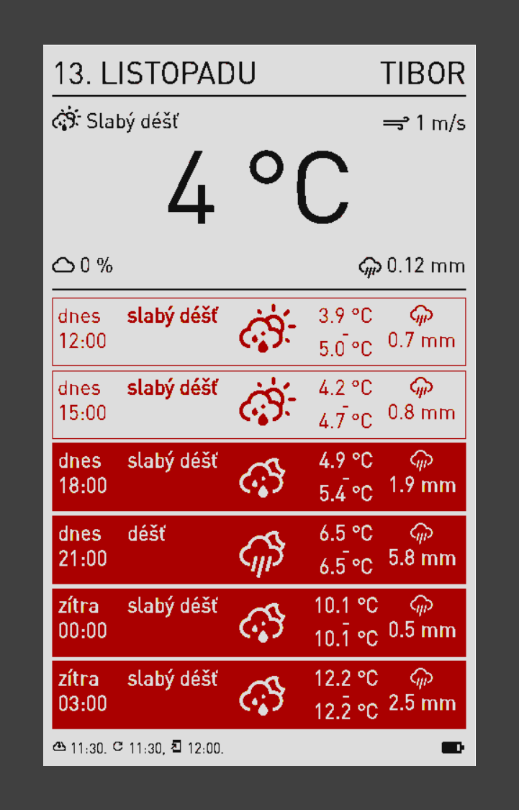
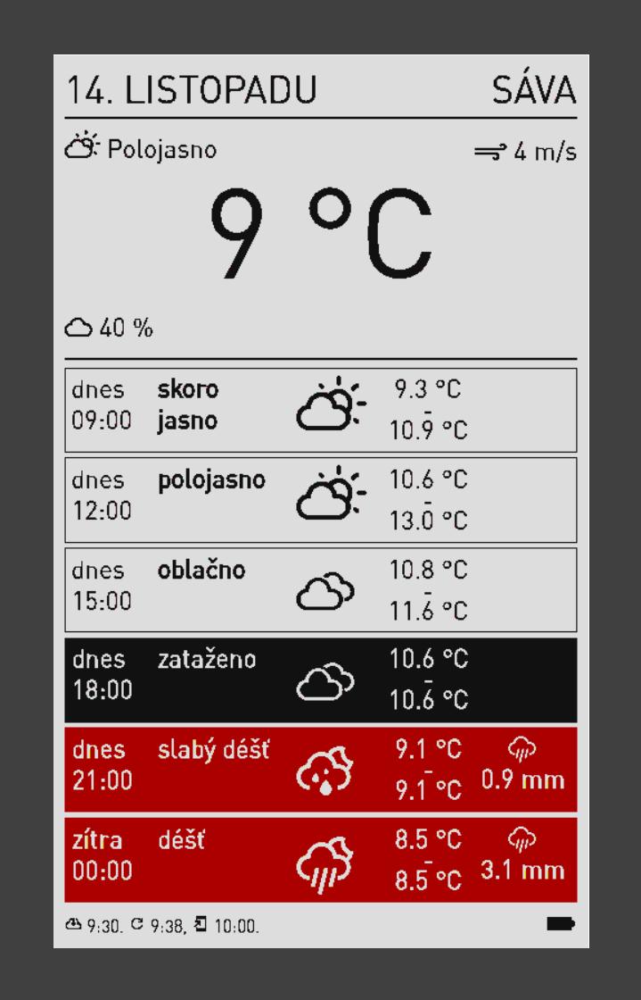
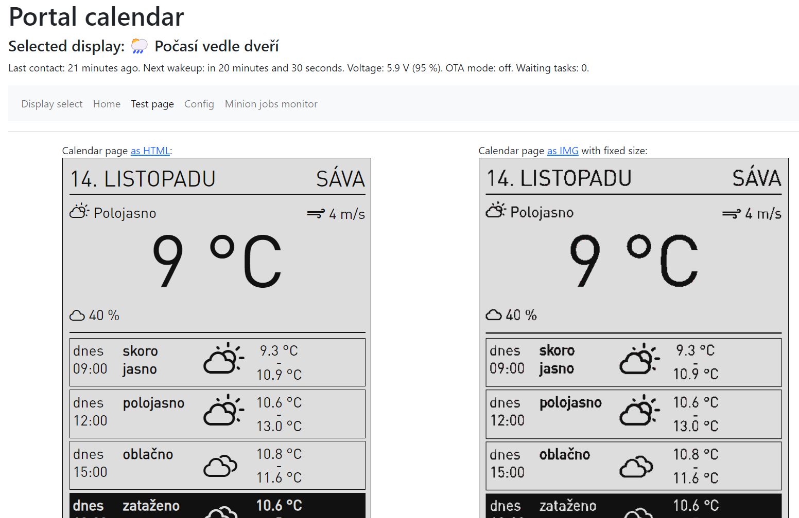
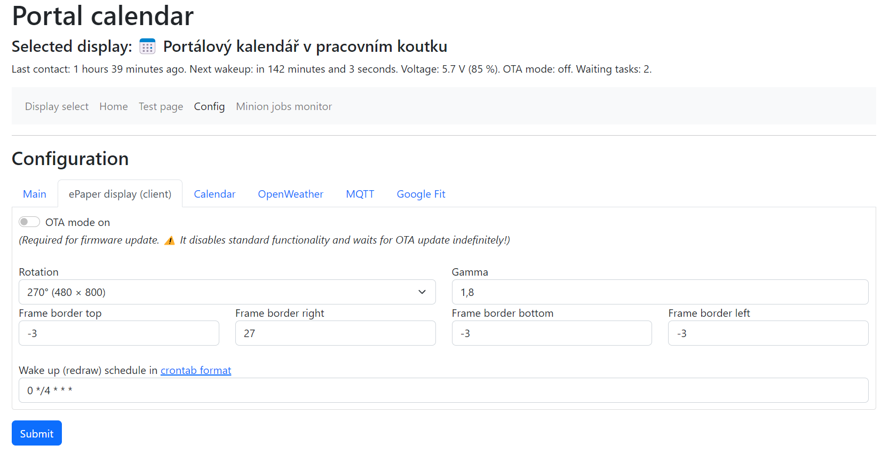
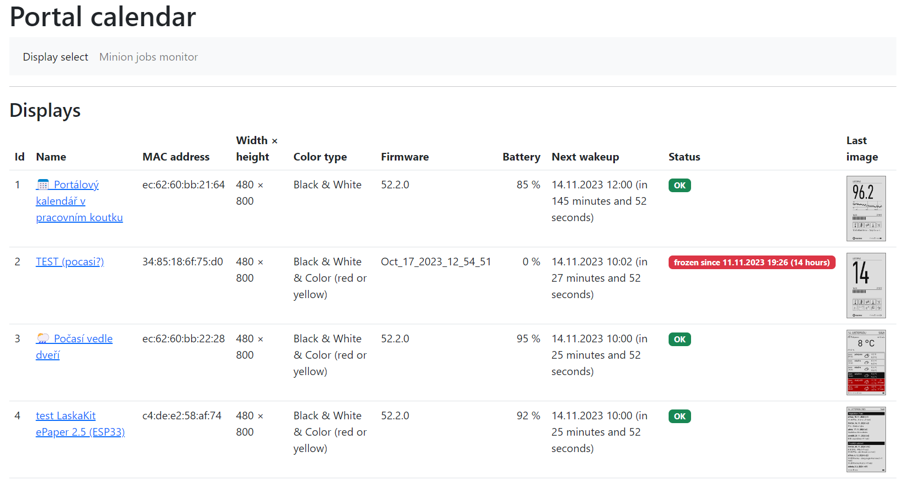
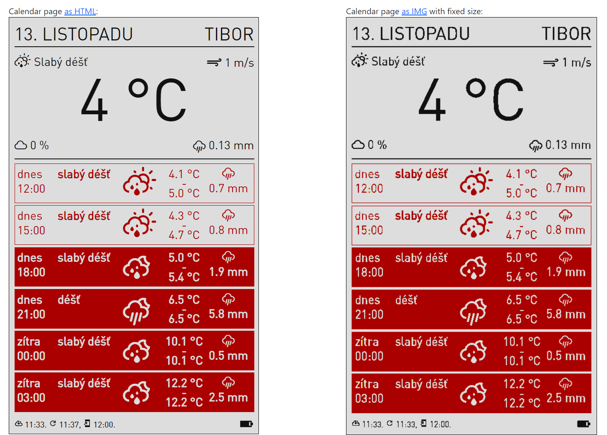

# "Portal" calendar for e-ink display

## Examples (screenshots)

## ⚠️ Important notice!

If you are interested in building this, please **consider using the [ZivyObraz](https://zivyobraz.eu/) service instead**. 
It's very reasonably priced (and first year free, IIRC), comes with a precompiled firmware for LaskaKit board and it is incredibly easy to use and set up.

Getting a copy of my project to work requires some non-trivial knowledge and I would only recommend it to people who like experimenting and who are willing to take this project as an inspiration for their own work. 
I *can't guarantee* that any of READMEs is up to date and that there are not hidden obstacles in getting the client or server part running. This repository contains almost all the source files for my calendars, but there are configuration files specific for my environment (e.g. WiFi password, server IP addresses etc.) and while I tried to put an equivalent of these filed to the "examples" folder, I can't guarantee it's directly usable without any modifications.

## Summary

Inspired by https://github.com/wuspy/portal_calendar. Hardware is mostly the same but the software is different.

The software is divided into two parts:
 1. Simple ESP32 web client which only handles the e-Paper display
 2. PC/Raspberry webserver + backend process which produces the images and takes care of everything else, e.g.:
    - integration with web calendars
    - integration with weather provider
    - integration with HomeAssistant (battery & status monitor), 
    - configuration UI
 
I've chosen this approach because it's easier and more fun for me to implement the server part in my favourite environments (C#/.NET and HTML+CSS) than to try to do this directly on ESP32.

Everything is designed for a specific e-Paper size of 480x800 pixels, but I'm trying to use relative units in CSS so it should be possible to use different size just by changing the screen and font size.

Images are served as raw bitmaps and the task for ESP is only to fetch this image and display it.

All the rendering is performed on the server, using standard HTML + CSS. This allows me to use provide content without constantly re-flashing the ESP32. It's also much easier for me to debug CSS and try to pixel-perfect position everything or to integrace for example ICS calendar etc.

I also added a voltage monitorig because with ePaper it's not easily detactable when the battery goes low -- the old image just keeps being on the display. Also the server tries to keep track of when each of the ePaper display should contact it and if it doesn't happen for a while, it will display a warning in the configuration UI (TODO: send this warning via email or Telegram message).

## Bill of materials

* Display:
  * [Waveshare 7.5" 800x480 ePaper B/W display](https://www.laskakit.cz/waveshare-7-5--640x384-epaper-raw-displej-bw/)
  * or [WFT0583CZ61 7.5" 800x480 ePaper B/W/R display](https://www.aliexpress.com/item/1005005121813674.html?spm=a2g0o.order_list.order_list_main.5.1a521802F7URVo)
* ESP32 board: [LaskaKit low power ePaper ESP32 board with USB-C and LiPol charging circuit](https://www.laskakit.cz/laskakit-espink-esp32-e-paper-pcb-antenna/)
* Power source: [LiPol battery](https://www.laskakit.cz/geb-lipol-baterie-805060-3000mah-3-7v-jst-ph-2-0/)
* ePaper frame: [3D printed frame by @MultiTricker](https://www.printables.com/model/541552-ramecek-pro-epaper-75-waveshare-i-good-display-v1/related)
* And optionally: [FFC cable](https://www.laskakit.cz/ffc-fpc-nestineny-flexibilni-kabel-awm-20624-80c-60v-0-5mm-24pin--10cm/) + [FFC FPC connector](https://www.laskakit.cz/laskakit-e-paper-ffc-fpc-24pin-atapter/) for easier connection between the display and the ESP32 board

## Sources:
 - The `custom-portal-sign-icons.png` and `custom-portal-sign-full.png` were downloaded from https://decalrobot.com/. 
   - Icons in the `server/public/images/portal_icons` were extracted manually from the image above
 - Fonts in `server/public/fonts` were downloaded from:
   - D-DIN-BOLD.otf, D-DIN.otf, D-DINCondensed.otf
     https://www.fontsquirrel.com/fonts/d-din (ASCII and basic accents only)
   - 651-font.otf
     https://cs.fontsisland.com/font/din-pro (full Czech set of characters)
 - Files in `client/wuspy_portal_calendar` are git-cloned from https://github.com/wuspy/portal_calendar.git (see `.gitmodules` file in the root folder)
 - "Broken display" overlay was downloaded from https://www.wallpaperflare.com/technology-cracked-screen-broken-screen-no-people-animal-wildlife-wallpaper-jpnv
 - Multi-display support (and other functionalities too) inspired by https://zivyobraz.eu/
 
## TODO

1. ~~Support for Czech localization and characters~~
1. ~~Grayed out icons~~
1. ~~Add support for iCal.~~
1. ~~Fix the icons at the bottom, make more of them available, make them more random.~~
1. ~~Indicate possible WiFi outage or server unavailability on the display.~~
1. ~~Refresh the display only if image has changed (=check image checksum against the previous value). This should allow the portal calendar to ask server periodically more often but still sleep a lot and preserve energy.~~
1. ~~Replace the ESP8266 ePaper module with what [original project](https://github.com/wuspy/portal_calendar) uses, i.e. specific low power ESP32 board + separate e-Paper hat [^1].~~
1. ~~Configurable through the UI.~~
1. ~~Offload calendar parsing to minion worker.~~
1. ~~Maybe add support for a weather forecast (but I'll probably create a different project just for this purpose).~~
1. ~~Add a config page to the server, to allow changing calendar properties (e.g. weather on/off, icon sets, etc.) easily without having to redeploy updated server.~~
1. ~~Add battery voltage measurement~~
1. ~~Add MQTT support (to see status in HomeAssistant)~~
1. ~~Add battery level indicator~~
1. ~~Add integration with Google Fit and display a weight data+chart~~
1. ~~Add support for multiple calendars (inspired by https://zivyobraz.eu/)~~
1. ~~Better battery voltage monitoring + move more things from client to the server~~
1. ~~Multiple displays support~~
1. Alerts on client unavailability.
1. On the fly image generation (instead of pre-generating all the images)

[^1]: I didn't consider the need for ESP board with very low power consumption. I therefore bought one that was available immediately (ESP8266 with integrated e-Paper driver). But while it's perfectly usable when powered through USB, it wouldn't keep working sufficiently long with AAA batteries. I therefore switched to low power ESP32 board.
