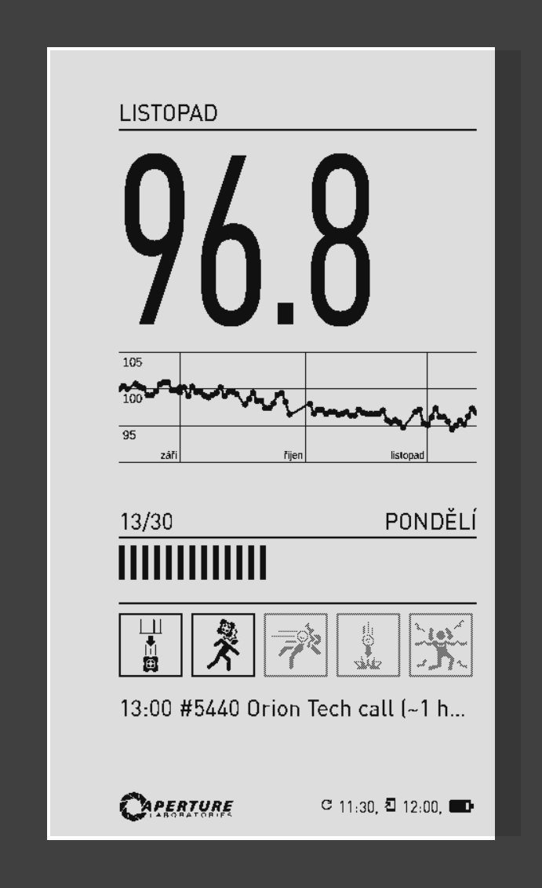
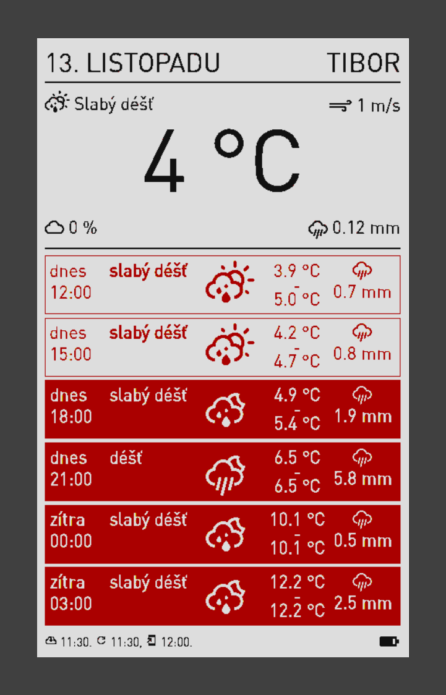
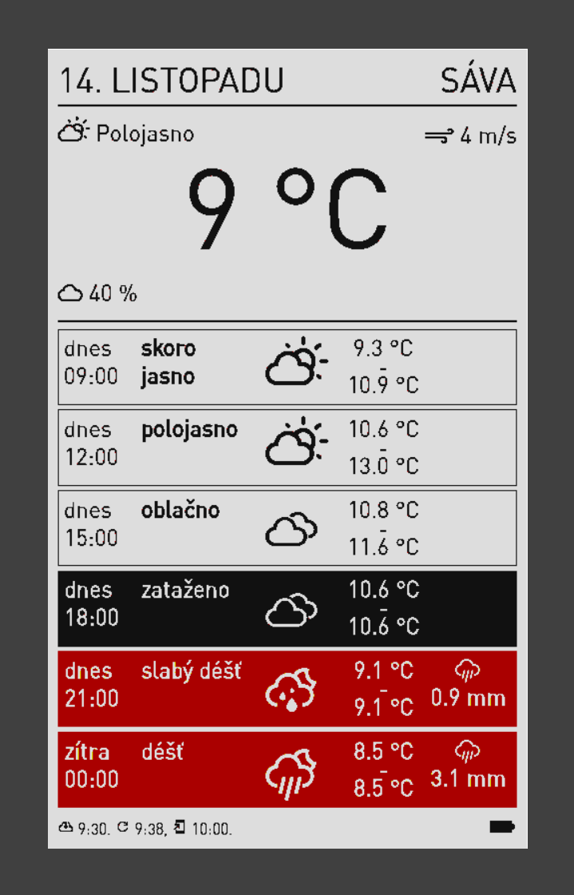
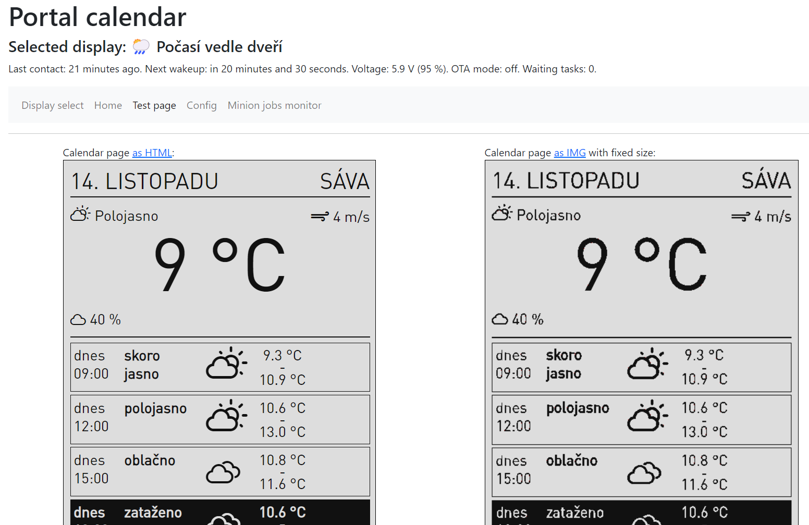
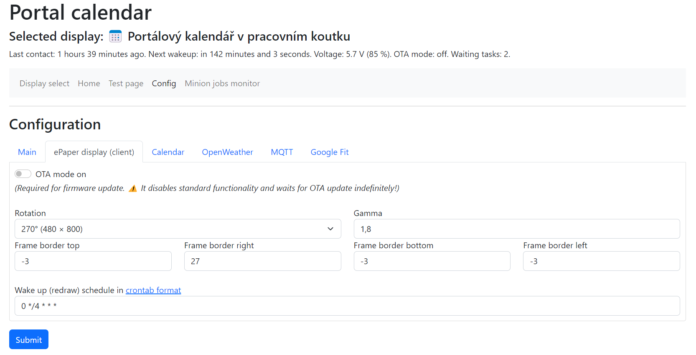
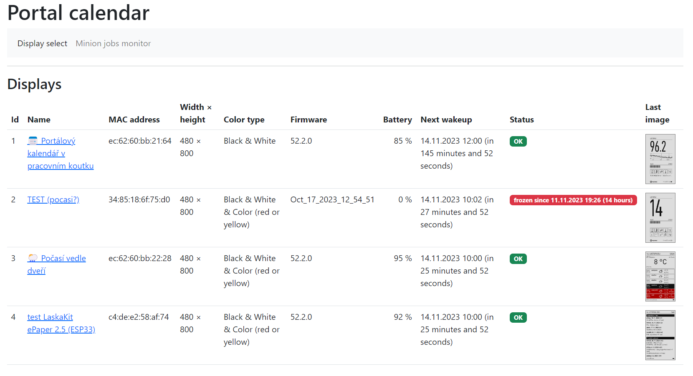
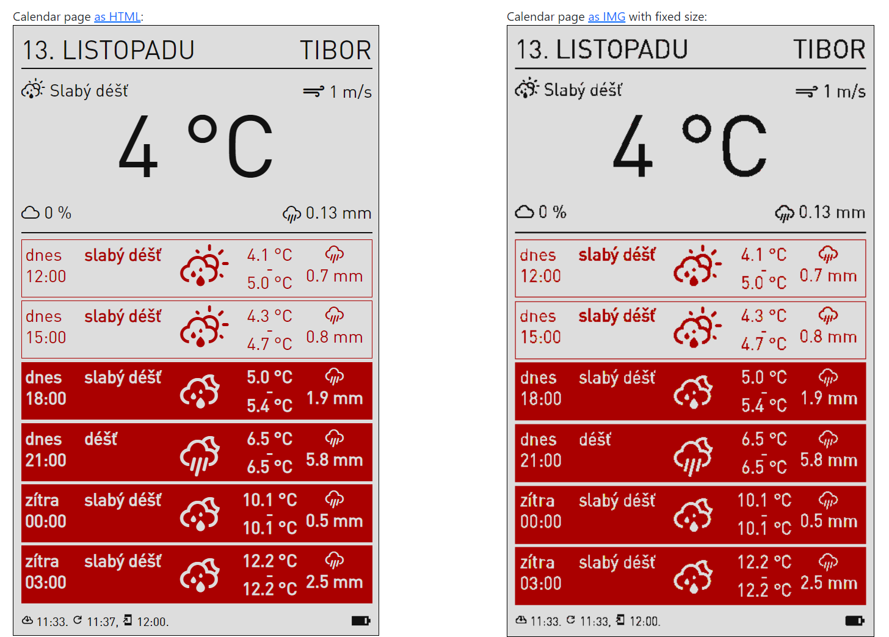

# "Portal" calendar for e-ink display


## Examples (screenshots)

[      ](screenshots/README.md)

## ⚠️ Important notice!

If you are interested in building this, please **consider using the [ZivyObraz](https://zivyobraz.eu/) service instead**. 
It's very reasonably priced (and first year free, IIRC), comes with a precompiled firmware for LaskaKit board and it is incredibly easy to use and set up.

Getting a copy of my project to work requires some non-trivial knowledge and I would only recommend it to people who like experimenting and who are willing to take this project as an inspiration for their own work. 
I *can't guarantee* that any of READMEs is up to date and that there are not hidden obstacles in getting the client or server part running. This repository contains almost all the source files for my calendars, but there are configuration files specific for my environment (e.g. WiFi password, server IP addresses etc.) and while I tried to put an equivalent of these files to the `client/include/boards/example/` and `client/include/boards/example_4color_GDEM075F52_and_laskakit_ESPink_v2.5/` folders, I can't guarantee it's directly usable without any modifications.

## Summary

Inspired by https://github.com/wuspy/portal_calendar. Hardware is mostly the same but the software is different.

The software is divided into two parts:
 1. Simple ESP32 web client which only handles the e-Paper display
 2. PC/Raspberry webserver + backend process which produces the images and takes care of everything else, e.g.:
    - integration with web calendars
    - integration with weather provider
    - integration with HomeAssistant (battery & status monitor), 
    - configuration UI
 
I've chosen this approach because it's easier and more fun for me to implement the server part in my favourite environments (C#/. NET and HTML+CSS) than to try to do this directly on ESP32.

Everything is designed for a specific e-Paper size of 480x800 pixels, but I'm trying to use relative units in CSS so it should be possible to use different size just by changing the screen and font size.

Images are served as raw bitmaps and the task for ESP is only to fetch this image and display it.

All the rendering is performed on the server, using standard HTML + CSS. This allows me to use provide content without constantly re-flashing the ESP32. It's also much easier for me to debug CSS and try to pixel-perfect position everything or to integrace for example ICS calendar etc.

I also added a voltage monitorig because with ePaper it's not easily detactable when the battery goes low -- the old image just keeps being on the display. Also the server tries to keep track of when each of the ePaper display should contact it and if it doesn't happen for a while, it will display a warning in the configuration UI (TODO: send this warning via email or Telegram message).

## Bill of materials

* Display:
  + [Waveshare 7.5" 800x480 ePaper B/W display](https://www.laskakit.cz/waveshare-7-5--640x384-epaper-raw-displej-bw/)
  + or [WFT0583CZ61 7.5" 800x480 ePaper B/W/R display](https://www.aliexpress.com/item/1005005121813674.html)
  + or [GDEM075F52 7.5" 4C 800x480 ePaper B/W/R/Y display](https://www.aliexpress.com/item/1005010179550278.html)
* ESP32 board: [LaskaKit low power ePaper ESP32 board with USB-C and LiPol charging circuit](https://www.laskakit.cz/laskakit-espink-esp32-e-paper-pcb-antenna/)
* Power source: [LiPol battery](https://www.laskakit.cz/geb-lipol-baterie-805060-3000mah-3-7v-jst-ph-2-0/)
* ePaper frame: [3D printed frame by @MultiTricker](https://www.printables.com/model/541552-ramecek-pro-epaper-75-waveshare-i-good-display-v1/related)
* And optionally: [FFC cable](https://www.laskakit.cz/ffc-fpc-nestineny-flexibilni-kabel-awm-20624-80c-60v-0-5mm-24pin--10cm/) + [FFC FPC connector](https://www.laskakit.cz/laskakit-e-paper-ffc-fpc-24pin-atapter/) for easier connection between the display and the ESP32 board

## Installation

### 1. Server (. NET)

**Prerequisites:** [. NET 9 runtime](https://dotnet.microsoft.com/en-us/download/dotnet/9.0)

Run the server:

```
dotnet PortalCalendarServer.dll
```

or run `PortalCalendarServer.exe` directly on Windows.

By default the server listens on port **5000**. On first start it will create the SQLite database and run any pending migrations automatically.

> **Note:** If you are upgrading from an older database (< 2.0 version) you may encounter a migration error. See `server/PortalCalendarServer/INSTALL.md` for the fix.

Once running, open `http://<server-ip>:5000` in a browser to access the configuration UI where you can add displays, configure calendars, weather, and other integrations. Login to application is `admin` with password `changeme` .

### 2. Client (ESP32)

**Prerequisites:** [PlatformIO](https://platformio.org/) (VS Code extension or CLI)

**Step 1 — Choose a board config.**  
Copy the example that best matches your hardware from `client/include/boards/` (see the table of verified displays above). The available environments defined in `platformio.ini` are:

| Environment | Board config folder |
|---|---|
| `example` | `client/include/boards/example/` |
| `example2` | `client/include/boards/example_4color_GDEM075F52_and_laskakit_ESPink_v2.5/` |

**Step 2 — Edit `board.h` .**  
At minimum, set your server's IP address and port:

```cpp
#define CALENDAR_URL_HOST "192.168.x.x"   // IP of your server
#define CALENDAR_URL_PORT 5000
```

Adjust the display type, pin assignments, and voltage settings as needed.

**Step 3 — Flash the firmware.**

```
pio run -e example -t upload --upload-port COM3
```

Replace `example` with your chosen environment and `COM3` with the correct serial port (or `<hostname>.local` for OTA updates).

**Step 4 — Configure WiFi.**  
On first boot the ESP32 starts a WiFi access point `ESP-xxyyzz` (where xxyyzz is a part of the MAC address). Connect to it with your phone, enter your WiFi credentials in the captive portal, and save. The device will reboot and connect to your network.

**Step 5 — Wait for the first image.**  
After connecting to WiFi the ESP32 will contact the server and display the first generated image. This may take up to a minute as the server renders the bitmap on demand.

**Troubleshooting:** Connect to the serial port at 115200 baud to see detailed log output from the ESP32.

## Verified ePaper displays and controllers

See the `client/include/driver/` and `client/include/epaper` for a list of verified configurations.

## Sources:

 - The portal sign icons were downloaded from https://decalrobot.com/. 
   - Icons in `server/PortalCalendarServer/wwwroot/images/portal_icons` were extracted manually from the source image
 - Fonts in `server/PortalCalendarServer/wwwroot/fonts` were downloaded from:
   - `d-din/` — https://www.fontsquirrel.com/fonts/d-din (SIL Open Font License 1.1)
   - `gidole/` — https://github.com/larsenwork/Gidole (OFL + MIT)
   - `clear-sans/` — https://www.fontsquirrel.com/fonts/clear-sans (Apache License 2.0)
 - Weather Icons font — https://github.com/erikflowers/weather-icons (font: SIL OFL 1.1, CSS: MIT)
 - Multi-display support (and other functionalities too) inspired by https://zivyobraz.eu/

## License

The source code of this project is licensed under the **[MIT License](LICENSE)**.

The compiled firmware binary incorporates [GxEPD2](https://github.com/ZinggJM/GxEPD2) (GPLv3) and is therefore distributed as a combined work under the **[GNU General Public License v3](https://www.gnu.org/licenses/gpl-3.0.html)**.

Third-party assets bundled in this repository have their own licenses:

| Asset | License |
|---|---|
| D-DIN fonts ( `server/.../fonts/d-din/` ) | SIL Open Font License 1.1 |
| Gidole font ( `server/.../fonts/gidole/` ) | OFL + MIT |
| Clear Sans font ( `server/.../fonts/clear-sans/` ) | Apache 2.0 |
| Weather Icons ( `server/.../wwwroot/font/` ) | Font: SIL OFL 1.1, CSS: MIT |
| Open Sans, DejaVu Sans Mono (client header fonts) | Apache 2.0 / Bitstream Vera |
| Portal sign icons ( `server/.../images/portal_icons/` ) | © Valve Corporation (fan use) |
| GxEPD2 library | GNU General Public License v3 |
