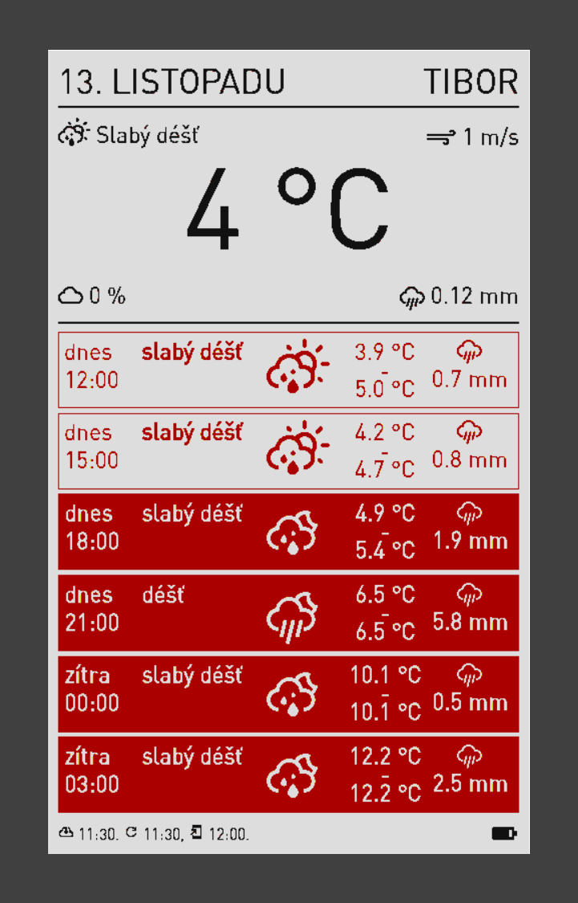
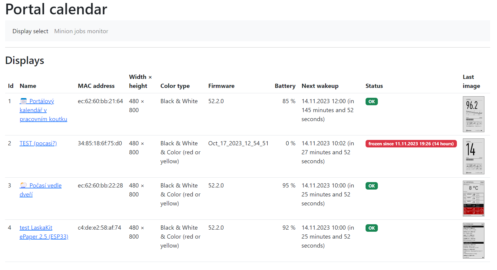
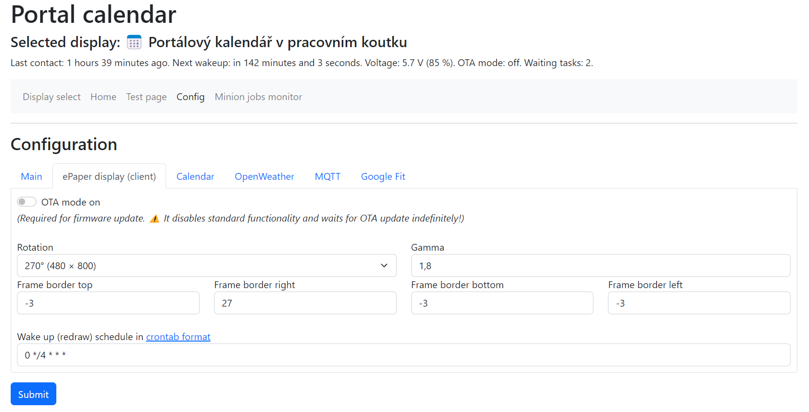

# Examples of different content on the display

### Comparison of the source (HTML + CSS) and the output

Source is smoothly antialiased while the bitmap for ePaper display needs to be posterized to only a few colors. 

### Configuration UI

